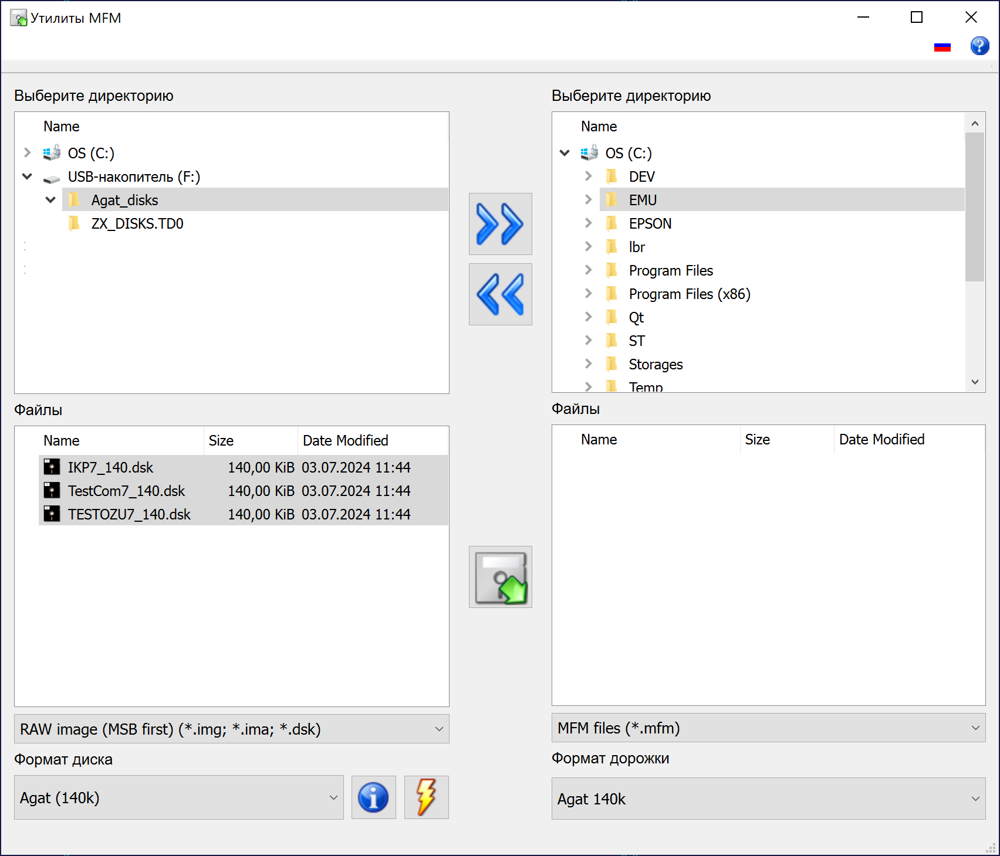

# Руководство пользователя

 
<small>Главное окно программы</small>

Главное окно программы разбито на две половины &ndash; в левой выбираются исходные файлы и их формат, в правой &ndash; директория для сконвертированных файлов и их формат.

Также доступны следующие элементы управления:

*  &ndash; скопировать выбранную директорию слева направо;
*  &ndash; скопировать выбранную директорию справа налево;
*  &ndash; запустить конвертацию;
*  &ndash; информация о выбранном формате;
*  &ndash; анализ выбранного файла;

В правом верхнем углу можно переключить язык и посмотреть информацию о программе.
