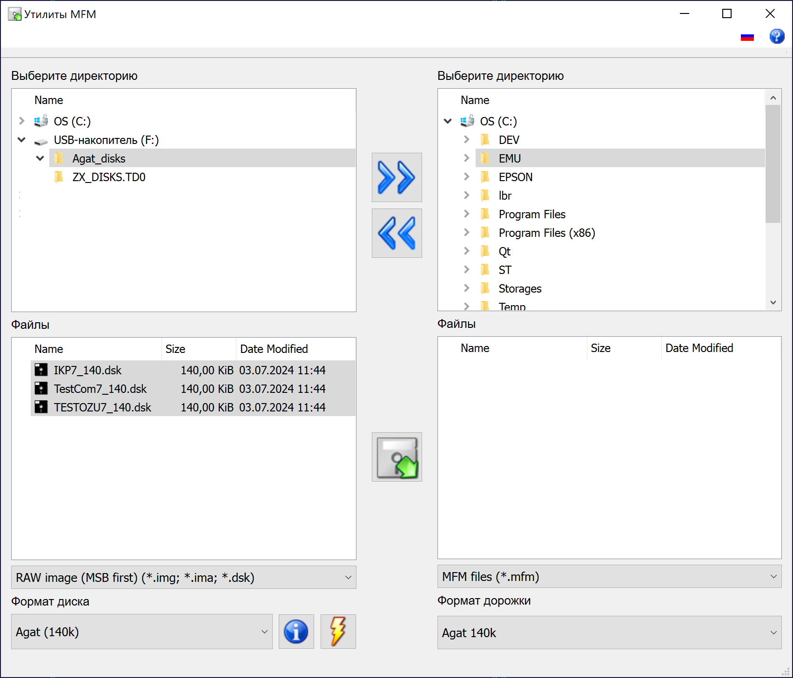

# MFMTools

 

MFMTools &ndash; утилита для конвертации файлов образов дисков для программных и аппаратных эмуляторов. На данный момент поддерживаются:
* Посекторные образы
* MFM-образы (HFE)
    * IBM PC
    * ДВК MX и MY (не тестировались)
    * Агат (Apple II) 140 кб
* TD0

 
<small>Главное окно программы</small>

* [Скачать последнюю версию](https://github.com/Ptr314/mfmtools/releases)
* [Руководство пользователя](MANUAL.md)
* [История версий](HISTORY.md)
* [Группа в Телеграме](https://t.me/ecat_emu)
* [Emuverse.ru](https://emuverse.ru) &ndash; энциклопедия эмуляции на русском языке.

Благодарности:

* David Vignoni за коллекцию иконок [Nuvola](https://commons.wikimedia.org/wiki/Category:Nuvola_icons);
* Олегу Одинцову за исходники [эмулятора компьютеров семейства &laquo;Агат&raquo;](http://agatcomp.ru/agat/PCutils/WinEmul.shtml), которые использовались как референс для решения некоторых вопросов по дисковым форматам &laquo;Агата&raquo;;
